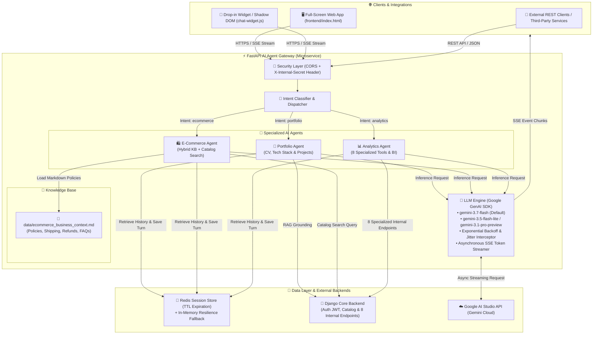

<div align="center">

# ⚡ Chatbot Engine Gateway
### *High-Performance Multi-Agent Orchestrator, Data Analytics & Automation Hub*

[](https://fastapi.tiangolo.com)
[](https://python.org)
[](https://aistudio.google.com/)
[](https://redis.io)
[](https://www.docker.com/)
[](https://render.com)
[](https://pytest.org)

<p align="center">
  <b>A production-grade AI microservice engineered for autonomous multi-agent orchestration, natural language Data Analytics & BI querying, hybrid markdown knowledge base grounding, ultra-low latency Server-Sent Events (SSE) streaming, and resilient cloud automation.</b>
</p>

---

[🚀 Quickstart](#-quickstart-guide) • [🏛️ Architecture](#-system-architecture) • [📊 Data Analytics & BI](#-data-analytics--business-intelligence-engine) • [🤖 Multi-Agent System](#-multi-agent-system--routing) • [🛠️ 8 Specialized Internal Tools](#-8-specialized-internal-tools--function-calling) • [📖 Hybrid Knowledge Base](#-hybrid-knowledge-base--rag-grounding) • [⚙️ Production Resilience](#-automation--production-resilience) • [📡 API Reference](#-api-specification)

---

</div>

## 🌟 Executive Summary

**Chatbot Engine Gateway** is an enterprise-ready asynchronous AI gateway designed to offload heavy LLM inference, real-time context grounding, and telemetry processing from core transactional backends (such as Django monoliths and microservice clusters).

This project demonstrates core competencies in **Modern Software Engineering**, **Automated Data Analytics & Business Intelligence**, **LLM Multi-Agent Orchestration**, and **Cloud Infrastructure Automation**:

- 📈 **Natural Language Data Analytics & BI**: Instant querying of business KPIs, conversion funnels, sales trends, inventory health, profit margins, RFM customer segmentation, reviews sentiment, and safe SQL execution with role-based JWT checks.
- 🤖 **Autonomous Multi-Agent Architecture**: Intelligent intent classification engine routing queries dynamically across specialized domain agents (`analytics`, `ecommerce`, `portfolio`).
- 📖 **Hybrid Knowledge Base Grounding**: Dual-context augmentation combining editable Markdown business policies (`data/ecommerce_business_context.md`) with real-time transactional database queries.
- 🛠️ **8 Internal Function Calling Tools**: Full integration with Django internal endpoints for automated data extraction and LLM grounding.
- ⚡ **High-Concurrency SSE Streaming**: Real-time token streaming via Server-Sent Events (`text/event-stream`) backed by automatic *Exponential Backoff + Jitter* resilience against upstream API rate limits (429/503).
- 🧠 **Distributed Session Memory**: Multi-turn conversation state persistence via Redis with auto-expiring TTL and an automated in-memory fallback store (*Zero-Downtime Resilience*).
- 🔄 **Automated Telemetry & Anti-Cold-Start**: Zero-dependency Python health script and GitHub Actions cron workflow measuring latency (RTT) and preventing cloud server spin-downs.
- 🎨 **Zero-Dependency Shadow DOM Widget**: Embeddable drop-in web component offering 100% CSS/JS style isolation, active markdown parsing, code copying, and streaming controls.

---

## 🏛️ System Architecture

The following diagram illustrates the complete data flow from end-user client interfaces to analytics resolution, context grounding, and real-time streaming:



---

## 🛠️ 8 Specialized Internal Tools & Function Calling

The gateway connects with Django's internal API via `X-Internal-Secret` authentication to expose 8 specialized analytical and catalog tools:

| # | Tool Name | HTTP Endpoint | Description & Capabilities |
|---|---|---|---|
| **1** | `query_sales_analytics` | `GET /api/v1/internal/analytics/query/` | Dynamic sales query with ad-hoc aggregations (revenue, units, costs, gross margins) by dimension. |
| **2** | `get_inventory_health` | `GET /api/v1/internal/inventory/health/` | Inventory health, critical stock alerts, out-of-stock items, total valuation, and 30-day Runout Rate. |
| **3** | `get_product_profitability` | `GET /api/v1/internal/analytics/margins/` | Gross margin % ranking (((Sales - Costs)/Sales)*100) grouped by product, category, or brand. |
| **4** | `get_funnel_and_cart_metrics` | `GET /api/v1/internal/analytics/funnel/` | E-commerce conversion funnel, cart abandonment rates, top abandoned products, and coupon ROI. |
| **5** | `get_customer_reviews_summary` | `GET /api/v1/internal/catalog/reviews-summary/` | Customer reviews sentiment summary, 1-5 star ratings distribution, and critical feedback alerts. |
| **6** | `get_customer_segmentation` | `GET /api/v1/internal/customers/insights/` | RFM customer segmentation (VIPs, At-Risk >60d, New <30d), Customer LTV, and regional stats. |
| **7** | `semantic_catalog_search` | `POST /api/v1/internal/catalog/semantic-search/` | Conceptual intent search in product catalog with cumulative relevance scoring. |
| **8** | `execute_raw_sql_sandbox` | `POST /api/v1/internal/query/raw-read/` | Defensive read-only SELECT execution (max 50 rows, timeout 2.0s, DDL/DML rejection). |

---

## 📖 Hybrid Knowledge Base & RAG Grounding

The `EcommerceAgent` uses a **Hybrid Grounding Architecture**:
1. **Business Knowledge Base (`data/ecommerce_business_context.md`)**:
   - Structured markdown document containing company information, shipping & delivery times, refund/cancellation policies (14-day money back guarantee), accepted payment methods (credit cards, bank transfer with 10% discount, crypto), FAQs, and support channels.
   - Cached in-memory via `KnowledgeBaseService` with timestamp (`mtime`) awareness to reflect live document updates without server reboots.
2. **Live Database Catalog Grounding**:
   - Real-time queries to Django for live product pricing, currencies, technical descriptions, stock, and customer reviews.
3. **Hybrid Assembly**:
   ```
   === 1. BUSINESS CONTEXT & COMPANY POLICIES (MARKDOWN) ===
   {markdown_business_context}

   === 2. LIVE DATABASE / CATALOG DATA (DJANGO API) ===
   {live_catalog_json}
   ```

---

## 🤖 Multi-Agent System & Routing

The gateway provides a modular orchestration system (`AgentDispatcher`) designed for clear separation of concerns:

| Agent | Identifier | Domain & Specialization | Key Capabilities |
| :--- | :---: | :--- | :--- |
| **Analytics & BI** | `analytics` | Business intelligence, sales performance, traffic metrics, inventory health, margins, and SQL sandbox. | `sales_analytics`, `inventory_health`, `product_profitability`, `conversion_funnel`, `customer_rfm_segmentation`, `safe_sql_sandbox` |
| **E-Commerce & Catalog** | `ecommerce` | Hybrid business knowledge, contextual catalog search, real-time stock, pricing, reviews, and purchase guidance. | `product_search`, `semantic_search`, `price_inquiry`, `stock_check`, `shipping_policies`, `refund_policies`, `payment_methods` |
| **Portfolio & Tech CV** | `portfolio` | Professional background, live tech stack showcase, architectural design review, and contact info. | `cv_inquiry`, `skills_overview`, `projects_showcase`, `architecture_consulting` |
| **Auto-Router** | `auto` | Heuristic & semantic classifier that automatically resolves and delegates messages to the optimal agent. | `intent_classification`, `fallback_routing` |

---

## 🧠 Google GenAI SDK & Model Hierarchy

The microservice integrates the official `google-genai` Python SDK with support for the latest Gemini 3.x series models:

| Model | Role | Configuration |
| :--- | :--- | :--- |
| **`gemini-3.7-flash`** | Default primary model | Optimal balance of agentic reasoning, function calling, speed, and accuracy. |
| **`gemini-3.5-flash-lite`** | High-throughput fallback | Maximum generation speed and low operational latency. |
| **`gemini-3.1-pro-preview`** | Deep reasoning fallback | Complex analytical calculations and advanced code generation. |

---

## ⚙️ Automation & Production Resilience

### 1. ⏱️ Anti-Hibernación Keep-Alive Engine
To optimize cloud infrastructure costs on serverless or eco-tier hosting (e.g., Render Free/Eco tier with 15-minute idle spin-down):
- **Automated CI/CD Workflow**: [`.github/workflows/keep_alive.yml`](file:///.github/workflows/keep_alive.yml) triggers health probes every 10 minutes.
- **Zero-Dependency Python Utility**: [`scripts/keep_alive.py`](file:///scripts/keep_alive.py) runs on pure standard library (`urllib.request`), measuring exact Round-Trip Time (RTT) in milliseconds with configurable exponential retries.

### 2. 🛡️ LLM Fault Tolerance (Exponential Backoff with Jitter)
The [`LLMClientService`](file:///app/services/llm_client.py) includes an automated retry interceptor:
- Catches transient API hiccups (`429 Rate Limit Exceeded`, `503 Service Unavailable`, `504 Gateway Timeout`, `Resource Exhausted`).
- Employs an exponential delay multiplier with randomized jitter, preventing synchronization spikes and cascading failures (*Thundering Herd* effect).

### 3. 💾 Dual-Tier Session Memory
If Redis encounters network partitions or downtime, the gateway seamlessly falls back to an in-memory session store (`InMemoryFallbackStore`), maintaining zero downtime for ongoing conversations.

---

## 📡 API Specification

### Primary Endpoints

| Method | Endpoint | Description | Auth |
| :--- | :--- | :--- | :---: |
| `POST` | `/api/v1/chat/stream` | Real-time conversational streaming (**Server-Sent Events**). | `X-Internal-Secret` (optional in dev) |
| `POST` | `/api/v1/chat` | Standard synchronous chat completion (Full JSON response). | `X-Internal-Secret` (optional in dev) |
| `GET` | `/api/v1/chat/agents` | Metadata and capability descriptors for all registered agents. | Public |
| `GET` | `/api/v1/chat/history/{session_id}` | Retrieves conversational message history for a session. | Public |
| `DELETE`| `/api/v1/chat/history/{session_id}` | Clears conversation memory for a specific session ID. | Public |
| `GET` | `/health` | Ultralight healthcheck (zero external dependency calls). | Public |
| `GET` | `/health/details` | Deep dependency check (verifies Redis and Django connectivity). | Public |
| `GET` | `/ping` | Minimal latency validation endpoint returning `{"ping": "pong"}`. | Public |

---

## 🚀 Quickstart Guide

### Prerequisites
- **Python 3.11+**
- **Docker & Docker Compose** (optional, for containerized runtimes)
- **Google AI Studio API Key** ([Get one here](https://aistudio.google.com/))
- **Redis Instance** (Local or Managed Serverless, e.g., Upstash)

### 1. Clone the Repository
```bash
git clone https://github.com/waycold/Chatbot-Engine-Gateway.git
cd Chatbot-Engine-Gateway
```

### 2. Environment Configuration
Copy the sample environment file and configure credentials:
```bash
cp .env.example .env
```

| Variable | Description | Example Value |
| :--- | :--- | :--- |
| `GEMINI_API_KEY` | Google AI Studio / Gemini API Key | `AIzaSyD...` |
| `DEFAULT_MODEL` | Default LLM model identifier | `gemini-3.7-flash` |
| `ECOMMERCE_CONTEXT_PATH` | Path to Markdown business context | `data/ecommerce_business_context.md` |
| `REDIS_URL` | Redis connection URI | `redis://localhost:6379/0` or `rediss://...` |
| `INTERNAL_API_SECRET` | Shared secret for inter-service authentication | `your_secure_internal_token` |
| `DJANGO_BACKEND_URL` | Base URL of transactional Django backend | `http://localhost:8000` |
| `BACKEND_CORS_ORIGINS`| Allowed CORS origins for web clients | `http://localhost:3000,http://127.0.0.1:3000` |

### 3. Local Execution with Virtual Environment

```bash
# Initialize and activate virtual environment
python -m venv venv
# On Windows:
.\venv\Scripts\activate
# On Linux/macOS:
source venv/bin/activate

# Install dependencies
pip install -r requirements.txt

# Start the development server
uvicorn app.main:app --reload --host 0.0.0.0 --port 8000
```
- 📖 **Interactive Swagger UI**: [http://localhost:8000/docs](http://localhost:8000/docs)
- 🔍 **OpenAPI Specification**: [http://localhost:8000/openapi.json](http://localhost:8000/openapi.json)
- 🖥️ **Frontend Demo**: Open [`frontend/index.html`](file:///frontend/index.html) in your browser.

---

## 🧪 Test Suite & Code Quality

The test suite validates schema integrity, agent dispatching, 8 internal endpoints, Markdown knowledge loading, and error boundaries:

```bash
pytest
```

---

## 🚢 Production Deployment (Render IaC Blueprint)

The repository provides automated Infrastructure-as-Code (IaC) via **Render Blueprints** ([`render.yaml`](file:///render.yaml)):

1. In your [Render Dashboard](https://dashboard.render.com/), click **New + > Blueprint**.
2. Connect this repository. Render will automatically parse `render.yaml` and provision the Docker web service.
3. Provide your environment secrets (`GEMINI_API_KEY`, `REDIS_URL`, etc.) under the **Environment** tab.
4. Continuous Deployment is active: every `git push` to `main` executes a zero-downtime rolling update.

---

## 👤 Author & Contact

- **Author**: Facundo
- **Role**: Senior Software & AI Engineer (Fullstack / Backend / Data & AI)
- **Core Competencies**: Python, FastAPI, Django, Google GenAI / LLM Orchestration, Redis, Docker, CI/CD, React, TypeScript.
- **GitHub**: [github.com/waycold](https://github.com/waycold)

---

<div align="center">
  <sub>Engineered with passion and industry-grade software practices. If you find this project valuable, please consider leaving a ⭐️ on the repository!</sub>
</div>
