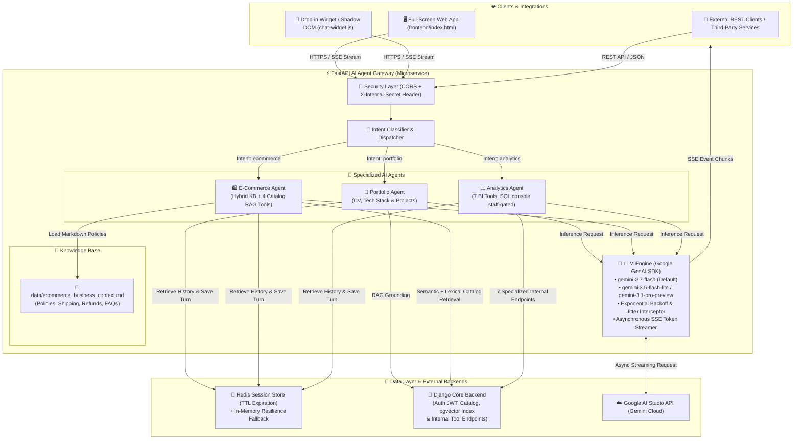

<div align="center">

# ⚡ Chatbot Engine Gateway
### *High-Performance Multi-Agent Orchestrator, Data Analytics & Automation Hub*

[](https://fastapi.tiangolo.com)
[](https://python.org)
[](https://aistudio.google.com/)
[](https://redis.io)
[](https://www.docker.com/)
[](https://render.com)
[](https://pytest.org)

<p align="center">
  <b>A production-grade AI microservice engineered for autonomous multi-agent orchestration, natural language Data Analytics & BI querying, hybrid markdown knowledge base grounding, ultra-low latency Server-Sent Events (SSE) streaming, and resilient cloud automation.</b>
</p>

---

[🚀 Quickstart](#-quickstart-guide) • [🏛️ Architecture](#-system-architecture) • [🤖 Multi-Agent System](#-multi-agent-system--routing) • [🛠️ 11 Specialized Internal Tools](#-11-specialized-internal-tools--function-calling) • [🔐 Tool Security Model](#-tool-authorization--security-model) • [🧬 Embeddings Ingestion](#-embeddings-ingestion-pipeline-pgvector) • [📖 Hybrid Knowledge Base](#-hybrid-knowledge-base--rag-grounding) • [⚙️ Production Resilience](#-automation--production-resilience) • [📡 API Reference](#-api-specification)

---

</div>

## 🌟 Executive Summary

**Chatbot Engine Gateway** is an enterprise-ready asynchronous AI gateway designed to offload heavy LLM inference, real-time context grounding, and telemetry processing from core transactional backends (such as Django monoliths and microservice clusters).

This project demonstrates core competencies in **Modern Software Engineering**, **Automated Data Analytics & Business Intelligence**, **LLM Multi-Agent Orchestration**, and **Cloud Infrastructure Automation**:

- 📈 **Natural Language Data Analytics & BI**: Instant querying of business KPIs, conversion funnels, sales trends, inventory health, profit margins, RFM customer segmentation, reviews sentiment, and safe SQL execution gated on Django's native `is_staff` / `is_superuser` flags.
- 🤖 **Autonomous Multi-Agent Architecture**: Intelligent intent classification engine routing queries dynamically across specialized domain agents (`analytics`, `ecommerce`, `portfolio`).
- 📖 **Hybrid Knowledge Base Grounding**: Dual-context augmentation combining editable Markdown business policies (`data/ecommerce_business_context.md`) with real-time transactional database queries.
- 🛠️ **11 Internal Function Calling Tools**: 7 analytics tools plus 4 catalog RAG tools, exposed to the model through a real multi-turn Gemini function-calling loop and dispatched against Django internal endpoints.
- 🧬 **pgvector RAG Retrieval & Ingestion**: Semantic catalog search over embeddings (asymmetric `RETRIEVAL_QUERY` / `RETRIEVAL_DOCUMENT` pair), with an internal ingestion worker that drains Django's embeddings outbox and a lexical fallback that keeps answering when the vector path is down.
- 🔐 **Three-Layer Tool Authorization**: Staff-gated routing, per-agent tool schemas, and an independent server-side dispatch allowlist — keeping the raw SQL console structurally unreachable from public chat rather than merely discouraged by a prompt.
- ⚡ **High-Concurrency SSE Streaming**: Real-time token streaming via Server-Sent Events (`text/event-stream`), now including `tool_start` / `tool_end` progress events, backed by automatic *Exponential Backoff + Jitter* resilience against upstream API rate limits (429/503).
- 🧠 **Distributed Session Memory**: Multi-turn conversation state persistence via Redis with auto-expiring TTL and an automated in-memory fallback store (*Zero-Downtime Resilience*).
- 🔄 **Automated Telemetry & Anti-Cold-Start**: Zero-dependency Python health script and GitHub Actions cron workflow measuring latency (RTT) and preventing cloud server spin-downs.
- 🎨 **Zero-Dependency Shadow DOM Widget**: Embeddable drop-in web component offering 100% CSS/JS style isolation, active markdown parsing, code copying, and streaming controls.

---

## 🏛️ System Architecture

The following diagram illustrates the complete data flow from end-user client interfaces to analytics resolution, context grounding, and real-time streaming:



---

## 🛠️ 11 Specialized Internal Tools & Function Calling

The gateway connects with Django's internal API via `X-Internal-Secret` authentication. Tools are declared in [`app/agents/tools.py`](file:///app/agents/tools.py) and dispatched by `execute_tool()`.

Two grounding mechanisms run side by side, deliberately:
1. **Eager grounding** — each agent's `get_context_augmentation()` performs Python-side keyword routing and injects the resulting JSON into the prompt before inference. Always on; this is what produces an answer when no API key is configured.
2. **Model-driven function calling** — a real multi-turn Gemini tool loop (`BaseAgent.run_tool_loop`) layered on top, active only when the agent declares tools, `ENABLE_TOOL_CALLING` is true, and a live LLM client is available. Bounded by `MAX_TOOL_ITERATIONS`; on the cap it performs one final text-only turn so the user always gets prose. Any failure inside the loop falls back to the plain generation path — the loop can never fail the endpoint. `PortfolioAgent` declares no tools and is therefore unaffected.

**How tool output returns to the model.** The primary path builds typed `types.Part.from_function_response(name=..., response=...)` parts and appends them as a single turn — roughly half the tokens per loop step, and one less free-text channel for a prompt-injection payload to travel through. When `google-genai` is not importable (CI, the test suite, offline tooling), the loop falls back to the dict-shaped `function_response` part **plus** a plain-text mirror of the same payload, wrapped by `_fence_tool_payload` in a nonce-delimited fence that marks the span as data rather than instructions. Which path ran is logged at INFO once per iteration, so it is unambiguous in production. The mandatory `[Catalog Retrieval Health]: status=degraded` disclosure turn is appended identically on both paths.

### 📊 Analytics Tools (7) — `AnalyticsAgent`

| # | Tool Name | HTTP Endpoint | Description & Capabilities |
|---|---|---|---|
| **1** | `query_sales_analytics` | `GET /api/v1/internal/analytics/query/` | Dynamic sales query with ad-hoc aggregations (revenue, units, costs, gross margins) by dimension. |
| **2** | `get_inventory_health` | `GET /api/v1/internal/inventory/health/` | Inventory health, critical stock alerts, out-of-stock items, total valuation, and 30-day Runout Rate. |
| **3** | `get_product_profitability` | `GET /api/v1/internal/analytics/margins/` | Gross margin % ranking (((Sales - Costs)/Sales)*100) grouped by product, category, or brand. |
| **4** | `get_funnel_and_cart_metrics` | `GET /api/v1/internal/analytics/funnel/` | E-commerce conversion funnel, cart abandonment rates, top abandoned products, and coupon ROI. |
| **5** | `get_customer_reviews_summary` | `GET /api/v1/internal/catalog/reviews-summary/` | Customer reviews sentiment summary, 1-5 star ratings distribution, and critical feedback alerts. |
| **6** | `get_customer_segmentation` | `GET /api/v1/internal/customers/insights/` | RFM customer segmentation (VIPs, At-Risk >60d, New <30d), Customer LTV, and regional stats. |
| **7** | `execute_raw_sql_sandbox` 🔒 | `POST /api/v1/internal/query/raw-read/` | Defensive read-only SELECT execution (max 50 rows, timeout 2.0s, DDL/DML rejection). **Staff-only** — see the security model below. |

### 🛍️ Catalog RAG Tools (4) — `EcommerceAgent`

| # | Tool Name | HTTP Endpoint | Description & Capabilities |
|---|---|---|---|
| **1** | `semantic_catalog_search` | `POST /api/v1/internal/catalog/vector-search/` | pgvector similarity search combined with hard metadata filters (price range, category, brand, stock). Degrades to the legacy lexical engine and tags the payload `status: "degraded"` rather than failing. |
| **2** | `check_stock_and_price` | `POST /api/v1/internal/catalog/items/verify/` | Exact live stock and price read at query time. The agent is required to call it before affirming any availability or price, because semantic search optimizes recall and is never a source of truth for availability. |
| **3** | `find_similar_products` | `POST /api/v1/internal/catalog/embeddings/similar/` | Vector neighbours of a given product, for "algo parecido a X" and cross-sell. |
| **4** | `list_catalog_facets` | `GET /api/v1/internal/catalog/facets/` | Valid category and brand values, so the model never invents a filter value that does not exist. |

> ⚠️ **Status of the Django side**: the RAG endpoints above (vector search, facets, item verification, similarity, and the embeddings outbox) are **not yet live in the Django monolith** — that is the other team's Fase 0. Until they ship, `app/services/django_api.py` serves realistic **in-code mock fallbacks** on HTTP failure, so the gateway is fully testable end to end. One module deliberately has **no** mock fallback: `app/services/embeddings.py` never fabricates a vector, because a fake embedding written into the index would corrupt search ranking permanently and undetectably.

---

## 🔐 Tool Authorization & Security Model

Authorization is enforced in **three independent layers**, so no single mistake (a prompt tweak, a hallucinated tool name, a prompt-injection payload) is sufficient to reach privileged data:

| Layer | Where | What it does |
| :--- | :--- | :--- |
| **1. Routing gate** | `AgentDispatcher._authorize_agent` | A request routed to `analytics` without a valid staff identity is **downgraded to the ecommerce agent** — an anonymous shopper who typed "reporte" still gets a helpful answer instead of an error. Fails closed on any validation error. |
| **2. Schema gate** | `BaseAgent.get_tool_declarations` | The tool schema is never included in the tool list sent to the model. `EcommerceAgent` is shown the 4 catalog tools **only**; `AnalyticsAgent` is shown `execute_raw_sql_sandbox` **only** when the current turn's token has already validated as staff. |
| **3. Dispatch allowlist** | `execute_tool(..., allowed_tools=...)` | The tool name is re-checked server-side at dispatch time and refused with `{"status": "error", "blocked": true}` before any call is made — so a hallucinated or injected tool name cannot execute even if it names a schema the model was never shown. |

### What "staff" means

Django's `auth_user` table has **no `role` column**. Privilege is expressed by the two native booleans and nothing else, so the gateway invents no role strings and consumes none:

```python
_is_staff(auth_status) ==
    bool(auth_status.get("authenticated")) and (
        auth_status.get("is_staff") is True or auth_status.get("is_superuser") is True
    )
```

The comparison is `is True`, never truthiness: a validator response that leaked the string `"false"` must not grant privilege. A missing, malformed or unresolved auth status fails closed.

> ⚠️ **Known tech debt**: reusing `is_staff` to authorize the read-only SQL console conflates two different permissions — access to the Django admin is not the same thing as permission to run SQL through a chat agent. It is an accepted simplification at this project's scope, to revisit if this grows past a portfolio system.

### `validate-token` contract

`DjangoAPIService.validate_user_token` calls `POST /api/v1/internal/auth/validate-token/` and **always** returns exactly these six normalized keys, whatever Django put on the wire:

| Key | Type | Meaning |
| :--- | :--- | :--- |
| `valid` | `bool` | Whether the token authenticated at all. |
| `user_id` | `Optional[int]` | Django `auth_user.id`. |
| `username` | `Optional[str]` | Django `auth_user.username`. |
| `is_staff` | `bool` | Native Django flag — half of the privilege predicate. |
| `is_superuser` | `bool` | Native Django flag — the other half. |
| `error` | `Optional[str]` | Reason for a denial; `None` on success. |

It **fails closed**: an unreachable or erroring auth service yields an unprivileged identity, never a permissive one. Successful validations are cached in-process for `TOKEN_VALIDATION_CACHE_TTL_SECONDS`, keyed by SHA-256 of the token — which is why the dispatcher and the analytics agent can each validate the same token within one turn without a second round trip to Django.

The agent-side dict derived from it — published into a request-scoped ContextVar, server-side only, never read back from the request payload — is `{"authenticated", "user_id", "username", "is_staff", "is_superuser"}`.

**Why the SQL console is excluded from the e-commerce agent rather than merely discouraged**: the RAG pipeline will ingest user-generated review text. A review body is an injection vector that reaches the model without the attacker ever joining the conversation. Prompt-level rules do not survive that threat model; structural unreachability does.

Beyond routing, `AnalyticsAgent.get_context_augmentation` also gates its own eager SQL branch on `_is_staff()`: a non-staff request never reaches the sandbox at all and receives an explicit `Acceso denegado` payload instead. All other analytics branches (inventory, margins, funnel, reviews, segmentation, sales, general KPIs) remain open — they are read-only aggregates.

---

## 📦 Canonical Catalog Item Contract

Every catalog method in `app/services/django_api.py` emits the same item shape, so no consumer has to branch on which endpoint produced it. Seven fields are **required**:

| Field | Type | Notes |
| :--- | :--- | :--- |
| `id` | `int` | Django primary key. |
| `title` | `str` | Canonical product name. |
| `slug` | `str` | **Authoritative for linking** — the chat widget builds `/product/<slug>/`, so a missing or invented slug renders a 404. Always `slugify(title)`. |
| `price` | `float` | Numeric, never a pre-formatted string. |
| `stock` | `int` | Point-in-time only; `check_stock_and_price` remains the single source of truth before affirming availability. |
| `brand` | `str` | Free-form brand label. |
| `category` | `str` | Must be a real value — call `list_catalog_facets` before filtering on it. |

Also present on every item: `currency`, `description`, `in_stock`, a **deprecated** `name` mirror of `title` (kept only for older widget builds — do not write new code against it), and the per-method score field: `similarity` for semantic search, `match_score` for lexical search, `semantic_score` for similarity neighbours.

The development mocks are **not** hand-written in Python: they are loaded from [`data/catalog_fixture.json`](file:///data/catalog_fixture.json), the shared mock source for both the gateway team and the Django team, so the two sides cannot drift apart on ids, slugs or prices.

---

## 🧬 Embeddings Ingestion Pipeline (pgvector)

Retrieval uses the **asymmetric** embedding pair: documents are embedded with `RETRIEVAL_DOCUMENT` at ingestion, queries with `RETRIEVAL_QUERY` at search time. Using the same task type on both sides measurably degrades recall.

Ingestion is an **outbox drain** exposed on internal, secret-protected routes ([`app/api/v1/internal_embeddings.py`](file:///app/api/v1/internal_embeddings.py)), all guarded by the `verify_internal_api_secret` dependency:

| Method | Endpoint | Behaviour |
| :--- | :--- | :--- |
| `POST` | `/api/v1/internal/embeddings/wake` | Returns **202 Accepted** immediately and queues the run as a background task. Django calls this after a catalog write and must never block on embedding work. |
| `POST` | `/api/v1/internal/embeddings/process-pending` | Synchronously drains one batch and returns `{status, processed, failed, total, elapsed_ms}`. This is the endpoint the keep-alive cron hits. |
| `GET` | `/api/v1/internal/embeddings/status` | Cheap operational visibility: current outbox depth, batch limit, and active model. |

Each task is isolated in its own `try/except`: a poison record is reported via `mark_embedding_error` and the loop continues, so one bad row can never stall the outbox behind it. The `mark_embedding_error` call is itself guarded for the same reason.

**Two independent size budgets, deliberately not shared:**

| Setting | Applies to | Why it exists |
| :--- | :--- | :--- |
| `EMBEDDING_INPUT_MAX_CHARS` (6000) | The text being **embedded** — product copy on ingestion, the user's query on search. | Defensive cap under the primary model's 8192-token input. |
| `EMBEDDING_FALLBACK_MAX_CHARS` (4500) | Same text when the **fallback** model is used. | That model accepts only 2048 tokens. 4500 ≈ 2.2 chars/token, which is what accented Spanish product copy actually costs — not the 3 chars/token rule of thumb inherited from English. |
| `PROMPT_CONTEXT_MAX_CHARS` (24000) | The grounding block injected into a **chat prompt**. | Chat models accept far larger inputs than embedding models, so this is a separate budget. `BaseAgent.build_conversation_contents` enforces it and appends a visible `[...contexto truncado por límite de tamaño...]` marker; the user's own message is never truncated. |

The character caps stand in for token limits because a deterministic slice costs no CPU, no dependency and no extra round trip on the hot retrieval path — a trade that only holds if the ratio behind them is measured. Recalibrate with [`scripts/calibrate_token_ratio.py`](file:///scripts/calibrate_token_ratio.py), which counts real tokens over real catalog text with the Gemini tokenizer and prints the value to write into `app/core/config.py`. Run it manually and rarely (after a large catalog import, or after switching embedding models); nothing reads it at runtime.

The GitHub Actions keep-alive workflow calls `/process-pending` on its existing 10-minute schedule (no second cron), which bounds index staleness at roughly 10 minutes even when a `/wake` webhook is lost to a cold start. That step is non-blocking: an embeddings hiccup never marks the keep-alive job as failed.

---

## 📖 Hybrid Knowledge Base & RAG Grounding

The `EcommerceAgent` uses a **Hybrid Grounding Architecture**:
1. **Business Knowledge Base (`data/ecommerce_business_context.md`)**:
   - Structured markdown document containing company information, shipping & delivery times, refund/cancellation policies (14-day money back guarantee), accepted payment methods (credit cards, bank transfer with 10% discount, crypto), FAQs, and support channels.
   - Cached in-memory via `KnowledgeBaseService` with timestamp (`mtime`) awareness to reflect live document updates without server reboots.
2. **Live Database Catalog Grounding**:
   - Real-time queries to Django for live product pricing, currencies, technical descriptions, stock, and customer reviews.
3. **Hybrid Assembly**:
   ```
   === 1. BUSINESS CONTEXT & COMPANY POLICIES (MARKDOWN) ===
   {markdown_business_context}

   === 2. LIVE DATABASE / CATALOG DATA (DJANGO API) ===
   {live_catalog_json}
   ```
4. **Retrieval Health Signal**: when a retrieval degradation is detected, a machine-readable `[Catalog Retrieval Health]` block with `degraded: true` is appended to the context. The system prompt makes disclosure mandatory — the reply must OPEN by telling the user in plain language that there was a technical problem searching the catalog and that results may be incomplete, *before* listing any products. Logging it internally is not sufficient: otherwise the customer makes a purchase decision believing they saw the whole catalog.

The model-driven tool loop is layered **on top of** this eager grounding, not in place of it. Both mechanisms remain active, which is why the gateway still answers usefully with `ENABLE_TOOL_CALLING=false` or with no API key configured.

---

## 🤖 Multi-Agent System & Routing

The gateway provides a modular orchestration system (`AgentDispatcher`) designed for clear separation of concerns:

| Agent | Identifier | Domain & Specialization | Key Capabilities |
| :--- | :---: | :--- | :--- |
| **Analytics & BI** | `analytics` | Business intelligence, sales performance, traffic metrics, inventory health, margins, and the staff-gated SQL sandbox. Requires a staff JWT; other callers are downgraded to `ecommerce`. | `sales_analytics`, `inventory_health`, `product_profitability`, `conversion_funnel`, `customer_rfm_segmentation`, `safe_sql_sandbox` 🔒 |
| **E-Commerce & Catalog** | `ecommerce` | Hybrid business knowledge, semantic (pgvector) catalog retrieval, real-time stock and price verification, reviews, and purchase guidance. | `product_search`, `semantic_search`, `price_inquiry`, `stock_check`, `shipping_policies`, `refund_policies`, `payment_methods` |
| **Portfolio & Tech CV** | `portfolio` | Professional background, live tech stack showcase, architectural design review, and contact info. | `cv_inquiry`, `skills_overview`, `projects_showcase`, `architecture_consulting` |
| **Auto-Router** | `auto` | Heuristic & semantic classifier that automatically resolves and delegates messages to the optimal agent. | `intent_classification`, `fallback_routing` |

---

## 🧠 Google GenAI SDK & Model Hierarchy

The microservice integrates the official `google-genai` Python SDK with support for the latest Gemini 3.x series models:

| Model | Role | Configuration |
| :--- | :--- | :--- |
| **`gemini-3.7-flash`** | Default primary model | Optimal balance of agentic reasoning, function calling, speed, and accuracy. |
| **`gemini-3.5-flash-lite`** | High-throughput fallback | Maximum generation speed and low operational latency. |
| **`gemini-3.1-pro-preview`** | Deep reasoning fallback | Complex analytical calculations and advanced code generation. |

---

## ⚙️ Automation & Production Resilience

### 1. ⏱️ Anti-Hibernación Keep-Alive Engine
To optimize cloud infrastructure costs on serverless or eco-tier hosting (e.g., Render Free/Eco tier with 15-minute idle spin-down):
- **Automated CI/CD Workflow**: [`.github/workflows/keep_alive.yml`](file:///.github/workflows/keep_alive.yml) triggers health probes every 10 minutes.
- **Piggybacked Embeddings Drain**: the same job then calls `POST /api/v1/internal/embeddings/process-pending` (60s cap, `continue-on-error`), reusing the existing schedule instead of adding a second cron. This bounds pgvector index staleness at ~10 minutes even if Django's `/wake` webhook is lost to a cold start, and an embeddings hiccup never marks the keep-alive job as failed.
- **Zero-Dependency Python Utility**: [`scripts/keep_alive.py`](file:///scripts/keep_alive.py) runs on pure standard library (`urllib.request`), measuring exact Round-Trip Time (RTT) in milliseconds with configurable exponential retries.

### 2. 🛡️ LLM Fault Tolerance (Exponential Backoff with Jitter)
The [`LLMClientService`](file:///app/services/llm_client.py) includes an automated retry interceptor:
- Catches transient API hiccups (`429 Rate Limit Exceeded`, `503 Service Unavailable`, `504 Gateway Timeout`, `Resource Exhausted`).
- Employs an exponential delay multiplier with randomized jitter, preventing synchronization spikes and cascading failures (*Thundering Herd* effect).

### 3. 💾 Dual-Tier Session Memory
If Redis encounters network partitions or downtime, the gateway seamlessly falls back to an in-memory session store (`InMemoryFallbackStore`), maintaining zero downtime for ongoing conversations.

---

## 📡 API Specification

### Primary Endpoints

| Method | Endpoint | Description | Auth |
| :--- | :--- | :--- | :---: |
| `POST` | `/api/v1/chat/stream` | Real-time conversational streaming (**Server-Sent Events**). | `X-Internal-Secret` (optional in dev) |
| `POST` | `/api/v1/chat` | Standard synchronous chat completion (Full JSON response). | `X-Internal-Secret` (optional in dev) |
| `GET` | `/api/v1/chat/agents` | Metadata and capability descriptors for all registered agents. | Public |
| `GET` | `/api/v1/chat/history/{session_id}` | Retrieves conversational message history for a session. | Public |
| `DELETE`| `/api/v1/chat/history/{session_id}` | Clears conversation memory for a specific session ID. | Public |
| `GET` | `/health` | Ultralight healthcheck (zero external dependency calls). | Public |
| `GET` | `/health/details` | Deep dependency check (verifies Redis and Django connectivity). | Public |
| `GET` | `/ping` | Minimal latency validation endpoint returning `{"ping": "pong"}`. | Public |
| `POST` | `/api/v1/internal/embeddings/wake` | Queues an embeddings ingestion run and returns `202` immediately. | `X-Internal-Secret` (**required**) |
| `POST` | `/api/v1/internal/embeddings/process-pending` | Drains one embeddings batch synchronously and returns the run summary. | `X-Internal-Secret` (**required**) |
| `GET` | `/api/v1/internal/embeddings/status` | Current embeddings outbox depth and active model. | `X-Internal-Secret` (**required**) |

### SSE Event Contract (`POST /api/v1/chat/stream`)

The token / completion contract is unchanged; two **additive** named events are interleaved so the client can show progress while a chained tool call runs (4-7s warm, far longer when Render and Neon are both cold). Clients that ignore named events keep working exactly as before.

```text
event: tool_start
data: {"tool": "semantic_catalog_search", "label": "Buscando en el catálogo...", "agent_id": "ecommerce", "session_id": "sess_abc12345"}

event: tool_end
data: {"tool": "semantic_catalog_search", "ok": true, "agent_id": "ecommerce", "session_id": "sess_abc12345"}

data: {"token": "Tenemos ", "agent_id": "ecommerce", "session_id": "sess_abc12345", "done": false}

data: {"token": "", "agent_id": "ecommerce", "session_id": "sess_abc12345", "done": true, "metadata": {...}}

data: [DONE]
```

Tokens and progress events are multiplexed onto a single queue with one consumer, so ordering is deterministic and there is no interleaving race. The `label` is a human-readable Spanish string from `TOOL_PROGRESS_LABELS`.

---

## 🚀 Quickstart Guide

### Prerequisites
- **Python 3.11+**
- **Docker & Docker Compose** (optional, for containerized runtimes)
- **Google AI Studio API Key** ([Get one here](https://aistudio.google.com/))
- **Redis Instance** (Local or Managed Serverless, e.g., Upstash)

### 1. Clone the Repository
```bash
git clone https://github.com/waycold/Chatbot-Engine-Gateway.git
cd Chatbot-Engine-Gateway
```

### 2. Environment Configuration
Copy the sample environment file and configure credentials:
```bash
cp .env.example .env
```

| Variable | Description | Example Value |
| :--- | :--- | :--- |
| `GEMINI_API_KEY` | Google AI Studio / Gemini API Key | `AIzaSyD...` |
| `DEFAULT_MODEL` | Default LLM model identifier | `gemini-3.7-flash` |
| `ECOMMERCE_CONTEXT_PATH` | Path to Markdown business context | `data/ecommerce_business_context.md` |
| `REDIS_URL` | Redis connection URI | `redis://localhost:6379/0` or `rediss://...` |
| `INTERNAL_API_SECRET` | Shared secret for inter-service authentication (also guards the embeddings routes) | `your_secure_internal_token` |
| `DJANGO_BACKEND_URL` | Base URL of transactional Django backend | `http://localhost:8000` |
| `BACKEND_CORS_ORIGINS`| Allowed CORS origins for web clients | `http://localhost:3000,http://127.0.0.1:3000` |
| `EMBEDDING_MODEL` | Primary embedding model for the pgvector index | `gemini-embedding-2` |
| `EMBEDDING_DIMENSIONS`| Stored vector dimensionality — must match the Django pgvector column | `768` |
| `EMBEDDING_BATCH_LIMIT`| Pending tasks pulled per ingestion run | `20` |
| `EMBEDDING_INPUT_MAX_CHARS`| Character cap on the text being embedded (not on chat prompts) | `6000` |
| `PROMPT_CONTEXT_MAX_CHARS`| Character cap on the grounding block injected into a chat prompt | `24000` |
| `ENABLE_TOOL_CALLING` | Enables the multi-turn Gemini function-calling loop | `true` |
| `MAX_TOOL_ITERATIONS` | Tool-call rounds before a final text-only turn is forced | `4` |
| `TOKEN_VALIDATION_CACHE_TTL_SECONDS`| TTL of the in-process token validation cache; `0` disables it | `20.0` |
| `TOKEN_VALIDATION_CACHE_MAX_ENTRIES`| Maximum validated tokens held in that cache | `512` |
| `OPENROUTER_API_KEY` | **Optional** chat/function-calling fallback; empty disables it entirely. Never used for embeddings. | *(empty)* |

The full annotated list lives in [`.env.example`](file:///.env.example).

### 3. Local Execution with Virtual Environment

```bash
# Initialize and activate virtual environment
python -m venv venv
# On Windows:
.\venv\Scripts\activate
# On Linux/macOS:
source venv/bin/activate

# Install dependencies
pip install -r requirements.txt

# Start the development server
uvicorn app.main:app --reload --host 0.0.0.0 --port 8000
```
- 📖 **Interactive Swagger UI**: [http://localhost:8000/docs](http://localhost:8000/docs)
- 🔍 **OpenAPI Specification**: [http://localhost:8000/openapi.json](http://localhost:8000/openapi.json)
- 🖥️ **Frontend Demo**: Open [`frontend/index.html`](file:///frontend/index.html) in your browser.

---

## 🧪 Test Suite & Code Quality

The test suite validates schema integrity, agent dispatching, the internal tool endpoints, tool authorization, Markdown knowledge loading, and error boundaries:

```bash
pytest
```

---

## 🚢 Production Deployment (Render IaC Blueprint)

The repository provides automated Infrastructure-as-Code (IaC) via **Render Blueprints** ([`render.yaml`](file:///render.yaml)):

1. In your [Render Dashboard](https://dashboard.render.com/), click **New + > Blueprint**.
2. Connect this repository. Render will automatically parse `render.yaml` and provision the Docker web service.
3. Provide your environment secrets (`GEMINI_API_KEY`, `REDIS_URL`, etc.) under the **Environment** tab.
4. Continuous Deployment is active: every `git push` to `main` executes a zero-downtime rolling update.

---

## 👤 Author & Contact

- **Author**: Facundo
- **Role**: Senior Software & AI Engineer (Fullstack / Backend / Data & AI)
- **Core Competencies**: Python, FastAPI, Django, Google GenAI / LLM Orchestration, Redis, Docker, CI/CD, React, TypeScript.
- **GitHub**: [github.com/waycold](https://github.com/waycold)

---

<div align="center">
  <sub>Engineered with passion and industry-grade software practices. If you find this project valuable, please consider leaving a ⭐️ on the repository!</sub>
</div>
