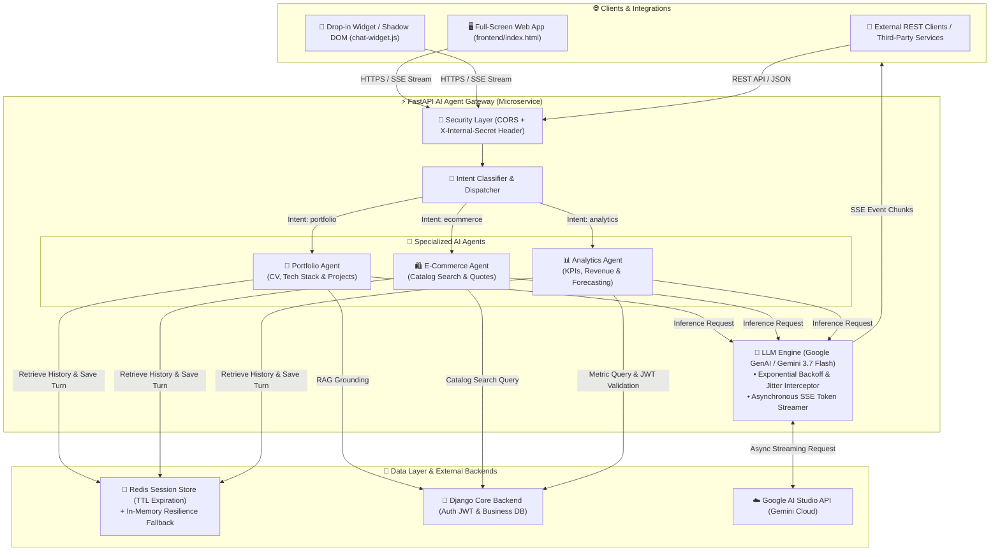

<div align="center">

# ⚡ Chatbot Engine Gateway
### *High-Performance Multi-Agent Orchestrator, Data Analytics & Automation Hub*

[](https://fastapi.tiangolo.com)
[](https://python.org)
[](https://aistudio.google.com/)
[](https://redis.io)
[](https://www.docker.com/)
[](https://render.com)
[](https://pytest.org)

<p align="center">
  <b>A production-grade AI microservice engineered for autonomous multi-agent orchestration, natural language Data Analytics & BI querying, ultra-low latency Server-Sent Events (SSE) streaming, and resilient cloud automation.</b>
</p>

---

[🚀 Quickstart](#-quickstart-guide) • [🏛️ Architecture](#-system-architecture) • [📊 Data Analytics & BI](#-data-analytics--business-intelligence-engine) • [🤖 Multi-Agent System](#-multi-agent-system--routing) • [⚙️ Automation & Resilience](#-automation--production-resilience) • [🎨 Drop-in Chat Widget](#-frontend--shadow-dom-drop-in-widget) • [📡 API Reference](#-api-specification)

---

</div>

## 🌟 Executive Summary

**Chatbot Engine Gateway** is an enterprise-ready asynchronous AI gateway designed to offload heavy LLM inference, real-time context grounding, and telemetry processing from core transactional backends (such as Django monoliths and microservice clusters).

This project demonstrates core competencies in **Modern Software Engineering**, **Automated Data Analytics & Business Intelligence**, **LLM Multi-Agent Orchestration**, and **Cloud Infrastructure Automation**:

- 📈 **Natural Language Data Analytics & BI**: Instant querying of business KPIs, conversion funnels, sales trends, demand forecasting, and executive reporting with JWT-based Role-Based Access Control (RBAC).
- 🤖 **Autonomous Multi-Agent Architecture**: Intelligent intent classification engine routing queries dynamically across specialized domain agents (`analytics`, `ecommerce`, `portfolio`).
- ⚡ **High-Concurrency SSE Streaming**: Real-time token streaming via Server-Sent Events (`text/event-stream`) backed by automatic *Exponential Backoff + Jitter* resilience against upstream API rate limits (429/503).
- 🧠 **Distributed Session Memory**: Multi-turn conversation state persistence via Redis with auto-expiring TTL and an automated in-memory fallback store (*Zero-Downtime Resilience*).
- 🔄 **Automated Telemetry & Anti-Cold-Start**: Zero-dependency Python health script and GitHub Actions cron workflow measuring latency (RTT) and preventing cloud server spin-downs.
- 🎨 **Zero-Dependency Shadow DOM Widget**: Embeddable drop-in web component offering 100% CSS/JS style isolation, active markdown parsing, code copying, and streaming controls.

---

## 🏛️ System Architecture

The following diagram illustrates the complete data flow from end-user client interfaces to analytics resolution, context grounding, and real-time streaming:



---

## 📊 Data Analytics & Business Intelligence Engine

The `AnalyticsAgent` (`app/agents/analytics.py`) serves as an automated **Business Intelligence & Data Analyst Copilot**. It interprets user prompts in natural language, resolves analytical metrics from backend data sources, and generates structured executive reports.

```
                  ┌────────────────────────────────────────────────────────┐
                  │ 💬 User: "Show me monthly sales KPIs and conversion"   │
                  └───────────────────────────┬────────────────────────────┘
                                              ▼
                  ┌────────────────────────────────────────────────────────┐
                  │ 🧠 Intent Classifier: 'analytics' (Focus: 'kpis')      │
                  └───────────────────────────┬────────────────────────────┘
                                              ▼
                  ┌────────────────────────────────────────────────────────┐
                  │ 🔐 JWT Token RBAC Validation (Roles: analyst / admin)  │
                  └───────────────────────────┬────────────────────────────┘
                                              ▼
                  ┌────────────────────────────────────────────────────────┐
                  │ 📈 Query Backend: /api/v1/internal/analytics/metrics   │
                  └───────────────────────────┬────────────────────────────┘
                                              ▼
┌───────────────────────────────────────────────────────────────────────────────────────────┐
│ 📊 Generated Executive Report (Markdown Tables + Decision Insights):                       │
│                                                                                           │
│ | Core Metric               | Current Value  | MoM Variation   | Status                   │
│ | :------------------------ | :------------- | :-------------- | :----------------------- │
│ | **Gross Revenue (GMV)**   | $54,200.00 USD | +14.2% 🟢       | Exceeding Monthly Target │
│ | **Daily Active Users**    | 1,520 DAU      | +8.5% 🟢        | Sustained Growth         │
│ | **Conversion Rate**       | 3.8%           | +0.4pp 🟢       | Optimal Range            │
│                                                                                           │
│ 💡 **Executive Takeaway**: 62% of transaction volume originates from Cloud AI Training...  │
└───────────────────────────────────────────────────────────────────────────────────────────┘
```

### 🔍 Supported Analytical Dimensions
- **Executive Summaries (`overview`)**: Core business KPIs (Daily Active Users, Gross Merchandise Value, bounce and conversion rates).
- **Top Performing Products (`top_products`)**: High-margin product identification, sales velocity, and inventory turnover.
- **Category Revenue Distribution (`category_distribution`)**: Share of wallet and revenue breakdown across service lines.
- **Predictive Forecasting & Trends (`forecast`)**: Qualitative and quantitative trend analysis across configurable horizons (`7d`, `30d`, `90d`, `1y`).
- **Granular RBAC Security**: JWT authorization verification preventing unauthenticated access to confidential company metrics.

---

## 🤖 Multi-Agent System & Routing

The gateway provides a modular and extensible orchestration system (`AgentDispatcher`) designed for clear separation of concerns:

| Agent | Identifier | Domain & Specialization | Key Capabilities |
| :--- | :---: | :--- | :--- |
| **Analytics & BI** | `analytics` | Business intelligence, sales performance, traffic metrics, and executive summaries. | `kpi_metrics`, `sales_reporting`, `conversion_funnel`, `forecast` |
| **E-Commerce & Catalog** | `ecommerce` | Contextual catalog search (RAG), real-time stock verification, pricing, and purchase guidance. | `product_search`, `price_inquiry`, `stock_check`, `purchase_guidance` |
| **Portfolio & Tech CV** | `portfolio` | Professional background, live tech stack showcase, architectural design review, and contact info. | `cv_inquiry`, `skills_overview`, `projects_showcase`, `architecture_consulting` |
| **Auto-Router** | `auto` | Heuristic & semantic classifier that automatically resolves and delegates messages to the optimal agent. | `intent_classification`, `fallback_routing` |

### 🛠️ Context Augmentation Pipeline (RAG)
Every agent implements the `get_context_augmentation()` hook:
1. Multi-turn session context is pulled from `RedisMemoryService`.
2. Dynamic external domain data (e.g., product catalog, analytics KPIs, CV records) is injected into the payload.
3. A structured, domain-constrained system prompt ensures fact-grounded responses and mitigates LLM hallucinations.

---

## ⚙️ Automation & Production Resilience

### 1. ⏱️ Anti-Hibernación Keep-Alive Engine
To optimize cloud infrastructure costs on serverless or eco-tier hosting (e.g., Render Free/Eco tier with 15-minute idle spin-down):
- **Automated CI/CD Workflow**: [`.github/workflows/keep_alive.yml`](file:///.github/workflows/keep_alive.yml) triggers health probes every 10 minutes.
- **Zero-Dependency Python Utility**: [`scripts/keep_alive.py`](file:///scripts/keep_alive.py) runs on pure standard library (`urllib.request`), measuring exact Round-Trip Time (RTT) in milliseconds with configurable exponential retries.
- **GitHub Step Summary Reports**: Real-time health statuses and response latencies are automatically published to the GitHub Actions dashboard.

### 2. 🛡️ LLM Fault Tolerance (Exponential Backoff with Jitter)
The [`LLMClientService`](file:///app/services/llm_client.py) includes an automated retry interceptor:
- Catches transient API hiccups (`429 Rate Limit Exceeded`, `503 Service Unavailable`, `504 Gateway Timeout`, `Resource Exhausted`).
- Employs an exponential delay multiplier with randomized jitter, preventing synchronization spikes and cascading failures (*Thundering Herd* effect).

### 3. 💾 Dual-Tier Session Memory
If Redis encounters network partitions or downtime, the gateway seamlessly falls back to an in-memory session store (`InMemoryFallbackStore`), maintaining zero downtime for ongoing conversations.

---

## 🎨 Frontend & Shadow DOM Drop-in Widget

The repository includes a modern, zero-dependency UI suite built with semantic HTML5, modern tokenized CSS, and asynchronous ES6+ JavaScript:

```
frontend/
├── index.html         # Full-Screen standalone chat interface with agent picker and health badges
├── chat-widget.js     # Universal Drop-in chat widget isolated via Shadow DOM (zero CSS collisions)
├── styles.css         # Modern design tokens, slate/zinc dark theme, and fluid responsive layouts
├── app.js             # Async SSE stream handler, native Markdown parser, and session manager
└── demo.html          # Simulated host portal demonstrating one-line drop-in widget integration
```

### 🔌 Single-Line Widget Integration
Drop the widget into any existing template (Django, React, Next.js, WordPress, or static HTML):

```html
<script 
  src="https://your-domain.com/chat-widget.js" 
  data-api-url="https://your-gateway.onrender.com"
  data-agent="portfolio"
></script>
```

#### Widget Highlights:
- 🛡️ **Shadow DOM Encapsulation**: Host application CSS styles will never bleed into or break the chat widget.
- 🌊 **Real-Time Token Rendering**: Consumes `ReadableStream` chunks with typing cursor animations and clean `AbortController` cancellation.
- 📝 **Built-in Markdown & Code Engine**: Renders tables, lists, and code blocks with an interactive **"Copy Code"** button.
- 🟢 **Live Health Beacon**: Continuous monitoring against `/health` (states: Online / Verifying / Offline).

---

## 📡 API Specification

### Primary Endpoints

| Method | Endpoint | Description | Auth |
| :--- | :--- | :--- | :---: |
| `POST` | `/api/v1/chat/stream` | Real-time conversational streaming (**Server-Sent Events**). | `X-Internal-Secret` (optional in dev) |
| `POST` | `/api/v1/chat` | Standard synchronous chat completion (Full JSON response). | `X-Internal-Secret` (optional in dev) |
| `GET` | `/api/v1/chat/agents` | Metadata and capability descriptors for all registered agents. | Public |
| `GET` | `/api/v1/chat/history/{session_id}` | Retrieves conversational message history for a session. | Public |
| `DELETE`| `/api/v1/chat/history/{session_id}` | Clears conversation memory for a specific session ID. | Public |
| `GET` | `/health` | Ultralight healthcheck (zero external dependency calls). | Public |
| `GET` | `/health/details` | Deep dependency check (verifies Redis and Django connectivity). | Public |
| `GET` | `/ping` | Minimal latency validation endpoint returning `{"ping": "pong"}`. | Public |

---

### Request & Response Examples

#### 1. Real-Time SSE Streaming (`curl`)
```bash
curl -N -X POST "http://localhost:8000/api/v1/chat/stream" \
  -H "Content-Type: application/json" \
  -d '{
    "agent_id": "analytics",
    "session_id": "sess_analytics_01",
    "message": "What were our top-performing products and revenue trends this month?",
    "stream": true
  }'
```

**SSE Event-Stream Output:**
```text
data: {"token":"📊 ","agent_id":"analytics","session_id":"sess_analytics_01","done":false}

data: {"token":"Executive ","agent_id":"analytics","session_id":"sess_analytics_01","done":false}

data: {"token":"Summary:","agent_id":"analytics","session_id":"sess_analytics_01","done":false}

...

data: {"token":"","agent_id":"analytics","session_id":"sess_analytics_01","done":true,"metadata":{"total_tokens_yielded":145,"latency_ms":310.5,"agent_name":"Analytics & Business Metrics Agent"}}

data: [DONE]
```

#### 2. Synchronous JSON Completion
```bash
curl -X POST "http://localhost:8000/api/v1/chat" \
  -H "Content-Type: application/json" \
  -d '{
    "agent_id": "ecommerce",
    "session_id": "sess_ecom_01",
    "message": "Do you offer microservices architecture consulting sessions?",
    "stream": false
  }'
```

---

## 🚀 Quickstart Guide

### Prerequisites
- **Python 3.11+**
- **Docker & Docker Compose** (optional, for containerized runtimes)
- **Google AI Studio API Key** ([Get one here](https://aistudio.google.com/))
- **Redis Instance** (Local or Managed Serverless, e.g., Upstash)

### 1. Clone the Repository
```bash
git clone https://github.com/waycold/Chatbot-Engine-Gateway.git
cd Chatbot-Engine-Gateway
```

### 2. Environment Configuration
Copy the sample environment file and configure credentials:
```bash
cp .env.example .env
```

| Variable | Description | Example Value |
| :--- | :--- | :--- |
| `GEMINI_API_KEY` | Google AI Studio / Gemini API Key | `AIzaSyD...` |
| `DEFAULT_MODEL` | Default LLM model identifier | `gemini-3.7-flash` |
| `REDIS_URL` | Redis connection URI | `redis://localhost:6379/0` or `rediss://...` |
| `INTERNAL_API_SECRET` | Shared secret for inter-service authentication | `your_secure_internal_token` |
| `DJANGO_BACKEND_URL` | Base URL of transactional Django backend | `http://localhost:8000` |
| `BACKEND_CORS_ORIGINS`| Allowed CORS origins for web clients | `http://localhost:3000,http://127.0.0.1:3000` |

### 3. Local Execution with Virtual Environment

```bash
# Initialize and activate virtual environment
python -m venv venv
# On Windows:
.\venv\Scripts\activate
# On Linux/macOS:
source venv/bin/activate

# Install dependencies
pip install -r requirements.txt

# Start the development server
uvicorn app.main:app --reload --host 0.0.0.0 --port 8000
```
- 📖 **Interactive Swagger UI**: [http://localhost:8000/docs](http://localhost:8000/docs)
- 🔍 **OpenAPI Specification**: [http://localhost:8000/openapi.json](http://localhost:8000/openapi.json)
- 🖥️ **Frontend Demo**: Open [`frontend/index.html`](file:///frontend/index.html) in your browser or run `python -m http.server 3000 --directory frontend`.

### 4. Running with Docker

Build and run using the optimized multi-stage container:
```bash
# Build Docker image
docker build -t ai-agent-gateway:latest .

# Run containerized service
docker run -d --name ai-gateway \
  -p 8000:8000 \
  --env-file .env \
  ai-agent-gateway:latest
```

---

## 🧪 Test Suite & Code Quality

The codebase enforces strict code quality and high reliability across schema validations, agent dispatchers, mock network handlers, and infrastructure configurations.

```bash
# Execute comprehensive pytest suite
pytest
```

**Test Execution Results:**
```text
============================= 90 passed in 16.68s =============================
```

### Test Coverage Breakdown:
- 🧪 `tests/test_api_chat.py`: REST and SSE endpoints, payload validation errors (422), rate limiting, and exception boundaries.
- 🧪 `tests/test_agents.py`: `AgentDispatcher` routing logic, intent classification heuristics, and grounding augmentation.
- 🧪 `tests/test_services.py`: Django HTTP client, Redis memory failover, and `LLMClientService` exponential backoff retries.
- 🧪 `tests/test_schemas.py`: Strict type validation and JSON serialization with Pydantic v2.
- 🧪 `tests/test_docker_and_infra.py`: Static verification of `Dockerfile` (non-root `appuser`), `render.yaml` IaC blueprint, and `keep_alive.py` utility.
- 🧪 `tests/test_health.py`: Health probes, dependency reporting, and CORS preflight options.

---

## 🚢 Production Deployment (Render IaC Blueprint)

The repository provides automated Infrastructure-as-Code (IaC) via **Render Blueprints** ([`render.yaml`](file:///render.yaml)):

1. In your [Render Dashboard](https://dashboard.render.com/), click **New + > Blueprint**.
2. Connect this repository. Render will automatically parse `render.yaml` and provision the Docker web service.
3. Provide your environment secrets (`GEMINI_API_KEY`, `REDIS_URL`, etc.) under the **Environment** tab.
4. Continuous Deployment is active: every `git push` to `main` executes a zero-downtime rolling update.

> 📚 *For advanced Uvicorn timeout configuration and SSL setup, read the [Render Deployment Guide](docs/deployment_render.md).*

---

## 👤 Author & Contact

This project is part of a professional software engineering and AI systems portfolio, showcasing expertise in distributed backend architecture, business intelligence automation, asynchronous microservices, and modern DevOps.

- **Author**: Facundo
- **Role**: Senior Software & AI Engineer (Fullstack / Backend / Data & AI)
- **Core Competencies**: Python, FastAPI, Django, Google GenAI / LLM Orchestration, Redis, Docker, CI/CD, React, TypeScript.
- **GitHub**: [github.com/waycold](https://github.com/waycold)

---

<div align="center">
  <sub>Engineered with passion and industry-grade software practices. If you find this project valuable, please consider leaving a ⭐️ on the repository!</sub>
</div>
